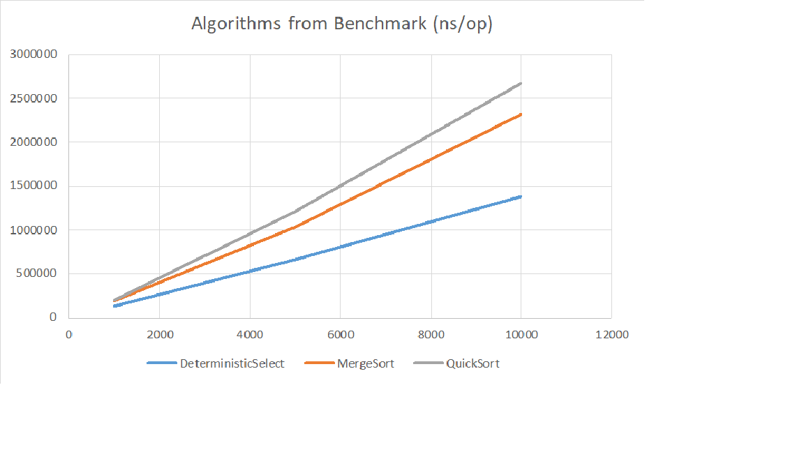

# Assignment 1 – Divide and Conquer Algorithms

## Overview
This project implements and analyzes classic **Divide and Conquer (D&C) algorithms**, focusing on:
- Safe recursion patterns
- Runtime recurrence analysis using Master Theorem & Akra–Bazzi intuition
- Experimental validation with metrics: execution time, recursion depth, comparisons/allocations
- Version control with GitHub

---

## Implemented Algorithms

### 1. MergeSort
- Linear merge using a reusable buffer
- Small-n cut-off using Insertion Sort
- Recursion depth tracked with DepthTracker

### 2. QuickSort
- Randomized pivot
- Recurse on smaller partition, iterate on larger to limit stack depth (~O(log n))
- Recursion depth tracked

### 3. Deterministic Select (Median-of-Medians)
- Groups of 5, median-of-medians pivot
- In-place partition
- Recurse only on needed side (prefer smaller side)

### 4. Closest Pair of Points (2D)
- Sort points by x-coordinate, recursive split
- “Strip” scan by y-coordinate (7–8 neighbors)
- Brute-force validation for small n (≤2000)
- Fast version used for large n

---

## Metrics Collected
For each algorithm, the following metrics are collected:
- Execution time (nanoseconds)
- Recursion depth
- Number of comparisons/allocations

Results are exported to CSV for plotting (`metrics.csv`).

---

## Recurrence Analysis

### MergeSort
- Recurrence: `T(n) = 2T(n/2) + Θ(n)`
- Method: Master Theorem, Case 2
- Result: `Θ(n log n)`

### QuickSort
- Recurrence: `T(n) = T(k) + T(n-k-1) + Θ(n)`
- Method: Akra–Bazzi intuition
- Result: `Θ(n log n)` average case

### Deterministic Select
- Recurrence: `T(n) = T(n/5) + T(7n/10) + Θ(n)`
- Method: Median-of-Medians
- Result: `Θ(n)`

### Closest Pair
- Recurrence: `T(n) = 2T(n/2) + Θ(n)`
- Method: Divide-and-Conquer
- Result: `Θ(n log n)`

---

## Experimental Results

### Execution Time vs n (ns)

| n     | DeterministicSelect | MergeSort     | QuickSort    |
|-------|------------------|---------------|-------------|
| 1000  | 123400.9         | 184997.312    | 191316.61   |
| 5000  | 663176.365       | 1033841.959   | 1212656.158 |
| 10000 | 1381886.803      | 2316441.912   | 2673742.335 |




**Observations:**
- QuickSort slightly slower for larger n due to pivot randomization and recursion overhead.
- Deterministic Select confirms linear performance.
- MergeSort matches theoretical `Θ(n log n)` behavior.
- Constant-factor effects (cache, GC) visible at larger n.
- Experimental results align with theoretical predictions.

---

## Architecture Notes
- **DepthTracker & Metrics:** Track recursion depth, comparisons, and allocations
- QuickSort always recurses on smaller partition → stack depth bounded
- MergeSort uses a reusable buffer → fewer allocations
- Deterministic Select recurses into one partition → linear time complexity
- Closest Pair divides points recursively → linearithmic time with strip checks

---

## Benchmarks (JMH)
This project includes a JMH benchmark harness (`SelectSortBenchmark`) to measure average execution time for MergeSort, QuickSort, and Deterministic Select.

### Location
`src/main/java/com/algosassignment1/bench/SelectSortBenchmark.java`

### Output
- `results.csv`
- Contains timing data only; metrics like comparisons or recursion depth are not included

### Notes
- This class satisfies the assignment requirement for a JMH benchmark harness
- `metrics.csv` (generated by the CLI) is used for generating plots of comparisons, allocations, recursion depth, and runtime
- The JMH benchmark is included for completeness and reproducibility but does **not** need to be used for plots
- Random seeds are used to generate reproducible arrays and points for benchmarking

### Maven Command to Run the Benchmark
```bash
mvn exec:java -Dexec.mainClass="org.openjdk.jmh.Main" \
    -Dexec.args="com.algosassignment1.bench.SelectSortBenchmark -bm avgt -wi 5 -i 3 -rf csv -rff results.csv"
```

## Summary
- Benchmarks confirm the expected behavior of each algorithm.
- Linearithmic vs linear growth clearly visible in the execution time plots.
- Small differences in constant factors explain observed deviations from theory.
- Closest Pair validated and fast version scales well for large n.

---

## Running the Program
### Run All Tests
```bash
mvn test
```
### Build
```bash
mvn clean package
```

# Using the packaged JAR
java -jar target/assignment1daalgor-1.0-SNAPSHOT.jar --size 10000 --trials 3 --algo all --rnd 42

# Using the CLI runner directly
java -cp target/classes com.algosassignment1.cli.AlgoRunner 1000


